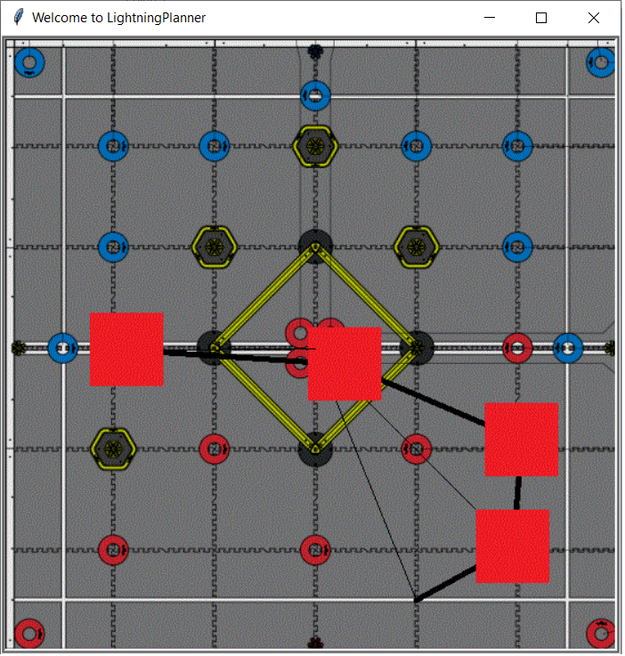

[](https://opensource.org/licenses/MPL-2.0)

# Python utilities 🐍
Lightning has different python utilities to **maximize** the user experience. 

## LightningPlanner



```txt
X: {185.0, 11.0, -180.0}
Y: {-88.0, -4.0, 1.0}
```

```console
Origin: x: 0 (inches)  y:  0 (inches)
x: 2.59 (inches)  y: 28.18 (inches)
x: -42.40 (inches)  y: 49.90 (inches)
x: -91.78 (inches)  y: 51.19 (inches)
X:  [185.0, 11.0, -180.0]
Y:  [-88.0, -4.0, 1.0]
```